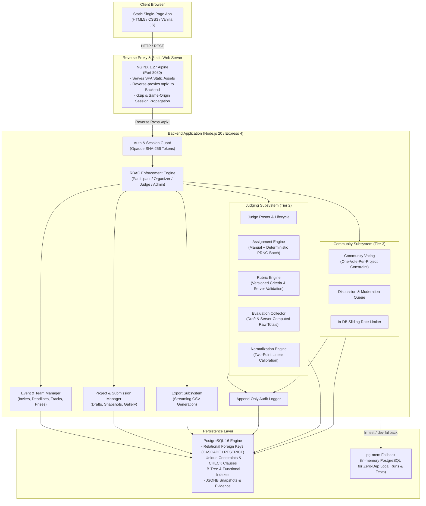
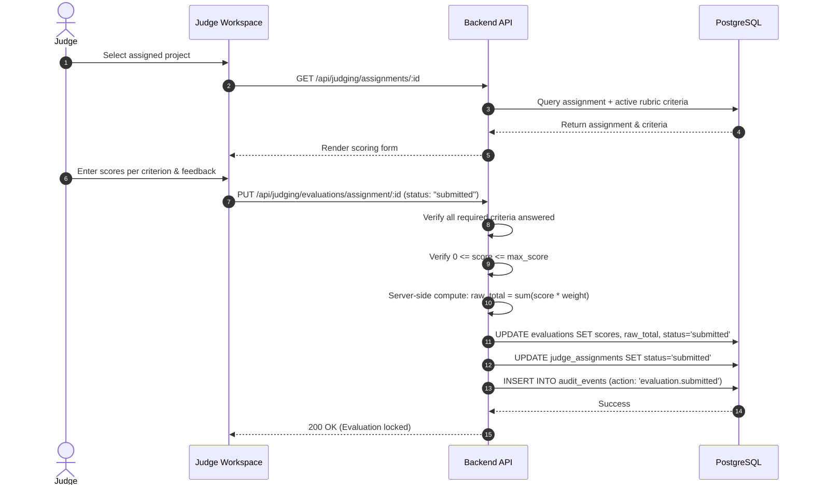
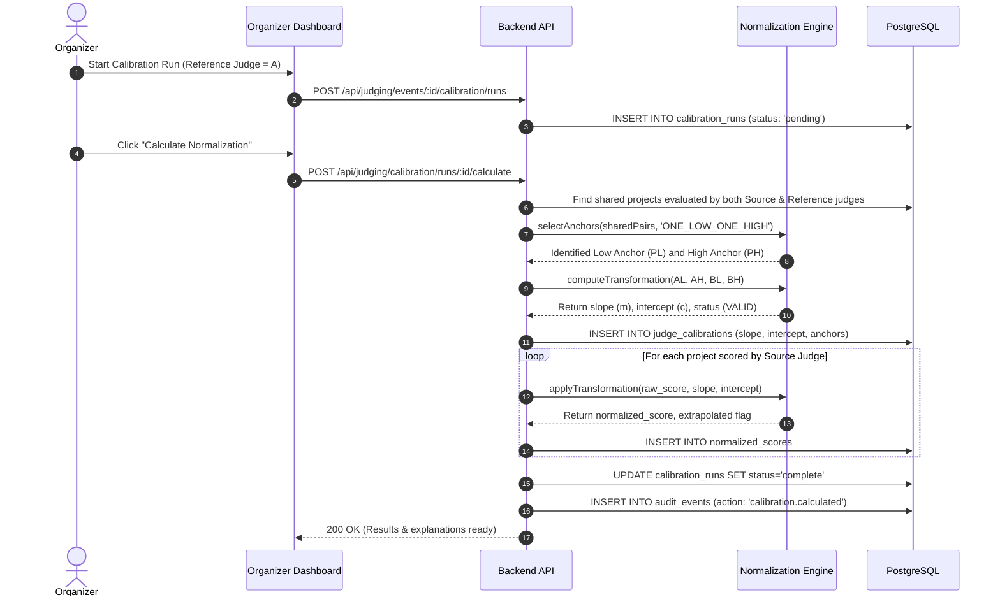
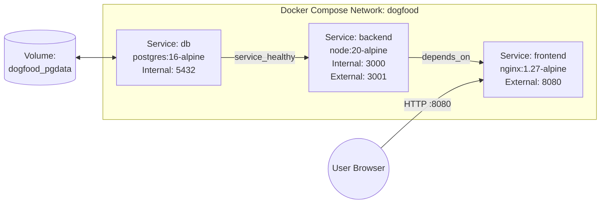

# DOGFOOD Architecture Specification

> **Implementation Status:** Tier 1 (Core Platform), Tier 2 (Judging & Normalization), and Tier 3 (Community Voting & Discussion) are fully implemented and verified with automated test suites (163/163 tests passing). Tier 4 platform extensions (Webhooks, Certificates) expose explicit, standards-compliant `501 Not Implemented` endpoints.

---

## 1. High-Level System Architecture

DOGFOOD is designed as a **self-hostable, offline-capable modular monolith** with strict boundaries between the static presentation layer, the API business logic layer, and the relational persistence engine.



---

## 2. Component Responsibilities

### 2.1 Frontend Single-Page Application (`frontend/`)
- **Zero-Dependency Vanilla JS:** Built with standards-compliant HTML5, responsive CSS, and native JavaScript without node build tools (Webpack, Vite), transpilers, or external CDN dependencies.
- **Hash-Based Router:** Maps browser hash fragments (e.g., `#/events`, `#/organizer/judging`, `#/voting`) to view renderers.
- **State Management & Session Sync:** Employs an event-driven `App` object that tracks the active session (`/api/auth/me`), reactive toasts, modal confirmations, countdown clocks, and breadcrumb navigation.
- **Form Validation & UX Polish:** Pre-validates user inputs client-side, gracefully surfaces backend field-level validation errors, and handles network degradation with responsive skeletons and empty states.

### 2.2 Reverse Proxy Layer (`frontend/nginx.conf`)
- **Same-Origin Architecture:** NGINX listens on port `8080`, serves static SPA files from `/usr/share/nginx/html`, and reverse-proxies `/api/` traffic directly to the backend container on port `3000`.
- **CORS-Free Execution:** Because the frontend and API share origin (`http://localhost:8080`), browser CORS preflight overhead is completely eliminated.
- **Cookie & Header Preservation:** Forwards `Host`, `X-Real-IP`, `X-Forwarded-For`, and `Set-Cookie` headers seamlessly.

### 2.3 Backend API Layer (`backend/src/`)
- **Express 4 Monolith (`src/app.js`):** Modular route definitions grouped by domain (`auth`, `events`, `teams`, `projects`, `submissions`, `gallery`, `organizer`, `judging`, `voting`, `comments`, `admin`).
- **Strict Payload Guards:** Express JSON parser configured with a strict `256kb` limit to prevent memory-exhaustion denial-of-service vectors.
- **Central Error Handling:** Ensures error responses follow standardized JSON envelopes (`{ error: string }`) and never leak internal stack traces or database connection details to clients.

### 2.4 Authentication & Authorization Subsystem (`src/auth.js`)
- **Opaque Database Sessions:** Users authenticate with email and bcrypt-hashed passwords. On login, a high-entropy 256-bit cryptographically secure random token is generated.
- **Token Hashing:** Only the `SHA-256` hash of the token is stored in the `sessions` table. A database breach never leaks usable session credentials.
- **Transport Security:** Tokens are issued via `httpOnly`, `SameSite=Lax` cookies with an optional `Authorization: Bearer <token>` fallback header for programmatic API consumers.
- **Role-Based Access Control (RBAC):** Middleware (`requireAuth`, `requireRole`) strictly verifies permissions on every request. Roles:
  - `participant`: Default role; manage personal profile, teams, project drafts, project submissions, and cast community votes.
  - `judge`: View assigned projects, draft evaluations, and submit scores within assigned events. Cannot view other judges' evaluations or organizer analytics.
  - `organizer`: Manage owned events, tracks, prizes, team rosters, judge assignments, rubrics, calibration runs, and export reports.
  - `admin`: Superuser role; manage all events, elevate user roles, inspect system health.

### 2.5 Judging Subsystem (`src/judging/` & `src/routes/judging.js`)
- **Assignment Subsystem:** Handles manual assignment and deterministic seeded batch assignment across active judges with strict workload limits.
- **Rubric Subsystem:** Configures multi-criteria scoring rubrics with weights and score constraints, versioned per event.
- **Evaluation Subsystem:** Collects draft and submitted criterion scores, enforces submission requirements, and computes weighted totals server-side.
- **Normalization Subsystem:** Executes two-point linear transformations using shared anchor projects to correct for judge leniency and strictness.
- **Explainability Engine:** Reconstructs the exact mathematical derivation of any normalized score from persisted database records.

### 2.6 Community Subsystem (`src/routes/voting.js` & `src/routes/comments.js`)
- **Voting Subsystem:** Manages voting rounds, project eligibility, one-vote-per-user-per-project constraints, and optional vote withdrawal.
- **Discussion Subsystem:** Captures project feedback with an integrated moderation workflow (`visible`, `hidden`, `flagged`, `deleted`).
- **Integrity Guardrails:** Enforces hidden vote counts during active voting to eliminate bandwagon effects, and applies seeded pseudo-random project ordering per user session to mitigate primacy bias.

### 2.7 Export Subsystem
- **RFC-4180 Compliant CSV Generation:** Generates evaluation-level and project-level CSV files on demand directly from relational query buffers.
- **Sanitized Values:** Automatically escapes quotes, commas, and formula injection characters (`=`, `+`, `-`, `@`).

---

## 3. Request & Data Flows

### 3.1 Participant Project Submission Flow

```mermaid
sequenceDiagram
    autonumber
    actor Participant
    participant SPA as Frontend SPA
    participant API as Backend API
    participant DB as PostgreSQL

    Participant->>SPA: Click "Submit Project"
    SPA->>API: POST /api/projects/:id/submit
    API->>DB: SELECT event_id, submission_deadline, status FROM events
    API->>API: Verify: now() <= submission_deadline
    API->>API: Validate title >= 3, description >= 20, links >= 1
    API->>DB: INSERT INTO submissions (snapshot = JSONB)
    API->>DB: UPDATE projects SET status = 'submitted'
    DB-->>API: 201 Created (with submitted_at timestamp)
    API-->>SPA: { ok: true, submission }
    SPA-->>Participant: Display Confirmed Badge & Timestamp
```

### 3.2 Judge Scoring Flow



### 3.3 Calibration & Score Normalization Flow



---

## 4. Authentication and Authorization Boundaries

### 4.1 Role Hierarchy & Access Matrix

| Endpoint Group | Unauthenticated | Participant | Judge | Organizer (Event Owner) | Platform Admin |
|---|---|---|---|---|---|
| `GET /api/events` (Published) | Yes | Yes | Yes | Yes | Yes |
| `POST /api/events` (Create Event) | No | No | No | Yes | Yes |
| `POST /api/projects/:id/submit` | No | Team Members Only | No | No | Admin Override |
| `GET /api/judging/mine` (Queue) | No | No | Assigned Only | No | No |
| `PUT /api/judging/evaluations/*` | No | No | Assigned Judge | No | No |
| `POST /api/judging/events/:id/*` | No | No | No | Own Events | All Events |
| `POST /api/voting/:id/votes` | No | Yes | Yes | Yes | Yes |
| `GET /api/admin/*` | No | No | No | No | Yes |

### 4.2 Judge Isolation Guarantee
A judge is restricted to their personal assignment queue (`/api/judging/mine`).
- Backend queries join explicitly against `judge_assignments.judge_id = req.user.id`.
- Judges cannot view evaluations submitted by other judges.
- Judges cannot view organizer calibration dashboards or aggregate results until publicly released.

---

## 5. Database Architecture & Persistence Strategy

### 5.1 Connection Pooling
- Node's `pg.Pool` manages connections to PostgreSQL 16.
- Connection parameters default to 20 maximum connections (`PG_POOL_MAX=20`), with a 30-second idle timeout and a 5-second connection acquisition timeout.
- Pool error listeners catch idle client disconnects and prevent node process termination.

### 5.2 Idempotent Schema Migrations (`src/migrate.js`)
- Migrations are stored as plain SQL scripts in `backend/migrations/*.sql`.
- A dedicated `schema_migrations (filename TEXT PRIMARY KEY, applied_at TIMESTAMPTZ)` table tracks applied migrations.
- On startup, the backend reads all migration files in alphabetical order, skips already recorded filenames, and executes unapplied migrations inside a single sequence before starting the HTTP listener.

### 5.3 In-Memory PostgreSQL Fallback Engine (`src/memdb.js`)
- For developer convenience, offline local runs, and fast automated test runs, DOGFOOD integrates `pg-mem`.
- When `USE_MEM_DB=true` or when no external PostgreSQL server is reachable during local development, DOGFOOD automatically initializes an in-memory PostgreSQL emulator and applies all SQL migrations verbatim.
- Tests execute in full SQL compliance without mocking HTTP routes or query builders.

---

## 6. Docker & Deployment Architecture

### 6.1 Container Topology & Services
DOGFOOD deploys via `docker compose up`:
1. **`db` (postgres:16-alpine):**
   - Stores persistent relational data in named Docker volume `dogfood_pgdata`.
   - Healthcheck: `pg_isready -U dogfood -d dogfood` (interval 5s, timeout 5s, retries 20).
2. **`backend` (node:20-alpine):**
   - Depends on `db` with `condition: service_healthy`.
   - Runs `server.js`, executing migration and idempotent seeding before binding to port 3000.
   - Healthcheck: Node HTTP fetch against `/api/health`.
3. **`frontend` (nginx:1.27-alpine):**
   - Depends on `backend`.
   - Listens on port `8080`, serving SPA static files and proxying `/api/*`.



---

## 7. Security Architecture

1. **Password Hashing:** Passwords hashed with `bcryptjs` using a salt work factor of 10. Plaintext passwords are never logged or stored.
2. **Session Security:** 256-bit cryptographically random tokens stored only as `SHA-256` hashes in PostgreSQL. Invalidation on logout is immediate and global.
3. **Strict Parameterized Queries:** Every database interaction uses SQL parameter bindings (`$1, $2, ...`). Zero string concatenation is used in query assembly.
4. **Deadline Enforcement:** All submission and edit operations validate the server's authoritative system clock against `events.submission_deadline`. Client-side timestamps are discarded.
5. **Vote Fraud Protection:** Unique database constraints `UNIQUE (voting_round_id, voter_id, project_id)` prevent race conditions and duplicate voting at the relational engine level.
6. **Rate Limiting:** Sliding window rate limiting stored directly in `rate_limit_events` prevents brute-force voting or comment spam without requiring Redis.

---

## 8. Scalability Considerations

- **Stateless Application Tier:** All state is persisted in PostgreSQL. Multiple backend instances can run behind a load balancer without sticky sessions.
- **Zero Full-Table Scans:** All queries on hot paths (event listings, gallery searches, submission reviews, judge queues) use covering B-Tree indexes.
- **Batch Aggregations:** Organizer dashboards and gallery views batch counts via `IN (...)` queries instead of $N+1$ query loops.
- **Static Assets at the Edge:** Frontend assets have zero server computation footprint and can be served from any CDN or reverse proxy cache.

---

## 9. Key Technical Decisions & Tradeoffs

| Decision | Chosen Technology / Pattern | Rationale | Alternatives Considered | Tradeoff Accepted |
|---|---|---|---|---|
| **Frontend Framework** | Vanilla HTML5 / CSS3 / JS SPA | Zero build step, 0 bundling errors, 100% offline-ready, instant startup | React / Next.js / Vue | More verbose DOM manipulation code in `app.js` |
| **Session Model** | Opaque Token + DB SHA-256 Hash | Instant server-side revocation on logout, zero shared secret keys | Stateless JWTs | Requires one indexed database query per authenticated request |
| **Testing Engine** | Native `node:test` + `supertest` + `pg-mem` | Zero heavy external test dependencies, executes 163 tests in < 45s | Jest / Mocha / Vitest | `pg-mem` requires pure PostgreSQL SQL syntax |
| **Normalization** | Two-Point Anchor Calibration | Accurate for small sample sizes ($n < 30$), grounded in concrete shared projects | Z-Score / Bradley-Terry | Requires organizers to assign at least 2 shared projects across judges |
| **Database** | PostgreSQL 16 Relational Engine | Relational integrity (FKs, CASCADE, CHECKs, JSONB, ACID) | MongoDB / DynamoDB | Schema changes require structured migration scripts |
