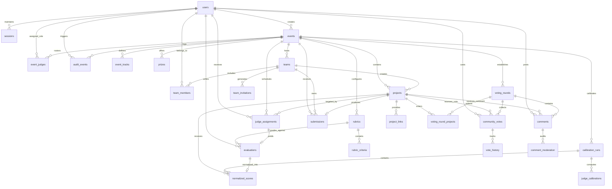

# DOGFOOD Relational Data Model Specification

> **Database Engine:** PostgreSQL 16  
> **Schema Migrations:** Managed sequentially via `backend/migrations/*.sql`  
> **Integrity Level:** Strict ACID relational integrity with Foreign Key constraints (`CASCADE`, `RESTRICT`, `SET NULL`), unique compound indexes, and check constraints (`CHECK`).

---

## 1. Entity-Relationship Diagram

---

## 2. Table Schemas & Column Specifications

### 2.1 Identity, Authentication & Sessions

#### `users`
Represents registered participants, event organizers, judges, and platform administrators.
- `id` (SERIAL PRIMARY KEY): Unique identifier.
- `email` (VARCHAR(255) NOT NULL UNIQUE): User email, lowercased on insertion. Indexed (`idx_users_email`).
- `password_hash` (TEXT NOT NULL): Salted bcrypt password hash (work factor 10).
- `name` (VARCHAR(120) NOT NULL): Full display name.
- `role` (VARCHAR(20) NOT NULL DEFAULT 'participant'): Role restriction `CHECK (role IN ('participant', 'organizer', 'judge', 'admin'))`. Indexed (`idx_users_role`).
- `created_at` (TIMESTAMPTZ NOT NULL DEFAULT now()).
- `updated_at` (TIMESTAMPTZ NOT NULL DEFAULT now()).

#### `sessions`
Opaque, stateful authentication sessions.
- `id` (SERIAL PRIMARY KEY): Unique session ID.
- `user_id` (INTEGER NOT NULL REFERENCES users(id) ON DELETE CASCADE): Session owner. Indexed (`idx_sessions_user`).
- `token_hash` (CHAR(64) NOT NULL UNIQUE): SHA-256 hash of the 256-bit opaque session token.
- `expires_at` (TIMESTAMPTZ NOT NULL): Expiry boundary (typically 30 days). Indexed (`idx_sessions_expires`).
- `created_at` (TIMESTAMPTZ NOT NULL DEFAULT now()).

---

### 2.2 Event Management

#### `events`
Hackathon event metadata and configuration.
- `id` (SERIAL PRIMARY KEY): Unique event ID.
- `title` (VARCHAR(200) NOT NULL): Event name.
- `slug` (VARCHAR(220) NOT NULL UNIQUE): URL-safe slug.
- `description` (TEXT NOT NULL DEFAULT ''): Event description and rules.
- `starts_at` (TIMESTAMPTZ NOT NULL): Hackathon kickoff timestamp.
- `ends_at` (TIMESTAMPTZ NOT NULL): Hackathon closing timestamp.
- `submission_deadline` (TIMESTAMPTZ NOT NULL): Hard deadline for project submissions. Indexed (`idx_events_deadline`).
- `status` (VARCHAR(20) NOT NULL DEFAULT 'draft'): `CHECK (status IN ('draft', 'published', 'archived'))`. Indexed (`idx_events_status`).
- `created_by` (INTEGER REFERENCES users(id) ON DELETE SET NULL): Organizer ID. Indexed (`idx_events_created_by`).
- `created_at` (TIMESTAMPTZ NOT NULL DEFAULT now()).
- `updated_at` (TIMESTAMPTZ NOT NULL DEFAULT now()).
- *Constraints:* `CONSTRAINT chk_event_dates CHECK (starts_at < ends_at)`.

#### `event_tracks`
Competition categories within an event.
- `id` (SERIAL PRIMARY KEY): Track identifier.
- `event_id` (INTEGER NOT NULL REFERENCES events(id) ON DELETE CASCADE). Indexed (`idx_tracks_event`).
- `name` (VARCHAR(120) NOT NULL): Track title (e.g., "AI & Machine Learning").
- `description` (TEXT NOT NULL DEFAULT ''): Track prompt.
- `position` (INTEGER NOT NULL DEFAULT 0): Display sorting order.
- `created_at` (TIMESTAMPTZ NOT NULL DEFAULT now()).

#### `prizes`
Prizes and awards offered in an event.
- `id` (SERIAL PRIMARY KEY): Prize identifier.
- `event_id` (INTEGER NOT NULL REFERENCES events(id) ON DELETE CASCADE). Indexed (`idx_prizes_event`).
- `title` (VARCHAR(200) NOT NULL): Prize title.
- `description` (TEXT NOT NULL DEFAULT ''): Award details.
- `amount` (VARCHAR(100) NOT NULL DEFAULT ''): Monetary value or award item.
- `position` (INTEGER NOT NULL DEFAULT 0): Display sorting order.
- `created_at` (TIMESTAMPTZ NOT NULL DEFAULT now()).

---

### 2.3 Teams & Participation

#### `teams`
Participant teams formed for an event.
- `id` (SERIAL PRIMARY KEY): Team identifier.
- `event_id` (INTEGER NOT NULL REFERENCES events(id) ON DELETE CASCADE). Indexed (`idx_teams_event`).
- `name` (VARCHAR(120) NOT NULL): Team name.
- `invite_code` (VARCHAR(32) NOT NULL UNIQUE): High-entropy invite code. Indexed (`idx_teams_invite`).
- `invite_expires_at` (TIMESTAMPTZ): Invitation expiration boundary (30 days from creation). Indexed (`idx_teams_invite_exp`).
- `created_by` (INTEGER REFERENCES users(id) ON DELETE SET NULL): Team creator.
- `created_at` (TIMESTAMPTZ NOT NULL DEFAULT now()).
- `updated_at` (TIMESTAMPTZ NOT NULL DEFAULT now()).

#### `team_members`
Association between participants and teams.
- `id` (SERIAL PRIMARY KEY).
- `team_id` (INTEGER NOT NULL REFERENCES teams(id) ON DELETE CASCADE). Indexed (`idx_members_team`).
- `user_id` (INTEGER NOT NULL REFERENCES users(id) ON DELETE CASCADE). Indexed (`idx_members_user`).
- `member_role` (VARCHAR(20) NOT NULL DEFAULT 'member'): `CHECK (member_role IN ('owner', 'member'))`.
- `joined_at` (TIMESTAMPTZ NOT NULL DEFAULT now()).
- *Constraints:* `UNIQUE (team_id, user_id)` ensures a participant cannot join a team multiple times. Business logic restricts participants to one team per event.

#### `team_invitations`
Audit log of invitations generated, accepted, or revoked.
- `id` (SERIAL PRIMARY KEY).
- `team_id` (INTEGER NOT NULL REFERENCES teams(id) ON DELETE CASCADE). Indexed (`idx_invites_team`).
- `code` (VARCHAR(32) NOT NULL). Indexed (`idx_invites_code`).
- `created_by` (INTEGER REFERENCES users(id) ON DELETE SET NULL).
- `status` (VARCHAR(20) NOT NULL DEFAULT 'pending'): `CHECK (status IN ('pending', 'accepted', 'revoked', 'expired'))`.
- `expires_at` (TIMESTAMPTZ).
- `created_at` (TIMESTAMPTZ NOT NULL DEFAULT now()).
- `accepted_by` (INTEGER REFERENCES users(id) ON DELETE SET NULL).
- `accepted_at` (TIMESTAMPTZ).

---

### 2.4 Projects & Submissions

#### `projects`
Project entities developed by teams.
- `id` (SERIAL PRIMARY KEY): Project identifier.
- `team_id` (INTEGER NOT NULL REFERENCES teams(id) ON DELETE CASCADE). Indexed (`idx_projects_team`).
- `event_id` (INTEGER NOT NULL REFERENCES events(id) ON DELETE CASCADE). Indexed (`idx_projects_event`).
- `title` (VARCHAR(200) NOT NULL): Project name. Indexed (`idx_projects_title_trgm`).
- `description` (TEXT NOT NULL DEFAULT ''): Detailed project writeup.
- `track_id` (INTEGER REFERENCES event_tracks(id) ON DELETE SET NULL). Indexed (`idx_projects_track`).
- `status` (VARCHAR(20) NOT NULL DEFAULT 'draft'): `CHECK (status IN ('draft', 'submitted', 'locked'))`. Indexed (`idx_projects_status`).
- `created_by` (INTEGER REFERENCES users(id) ON DELETE SET NULL).
- `created_at` (TIMESTAMPTZ NOT NULL DEFAULT now()).
- `updated_at` (TIMESTAMPTZ NOT NULL DEFAULT now()).

#### `project_links`
External references (e.g., GitHub repo, demo video, live deployment).
- `id` (SERIAL PRIMARY KEY).
- `project_id` (INTEGER NOT NULL REFERENCES projects(id) ON DELETE CASCADE). Indexed (`idx_links_project`).
- `label` (VARCHAR(120) NOT NULL): Link title.
- `url` (TEXT NOT NULL): Destination URL.
- `position` (INTEGER NOT NULL DEFAULT 0): Display position.
- `created_at` (TIMESTAMPTZ NOT NULL DEFAULT now()).

#### `submissions`
Frozen submission records capturing project state at submission time.
- `id` (SERIAL PRIMARY KEY).
- `project_id` (INTEGER NOT NULL UNIQUE REFERENCES projects(id) ON DELETE CASCADE): One submission per project.
- `event_id` (INTEGER NOT NULL REFERENCES events(id) ON DELETE CASCADE). Indexed (`idx_submissions_event`).
- `team_id` (INTEGER NOT NULL REFERENCES teams(id) ON DELETE CASCADE). Indexed (`idx_submissions_team`).
- `submitted_by` (INTEGER REFERENCES users(id) ON DELETE SET NULL).
- `submitted_at` (TIMESTAMPTZ NOT NULL DEFAULT now()). Indexed (`idx_submissions_time`).
- `snapshot` (JSONB NOT NULL DEFAULT '{}'): Immutable JSON capture of project title, description, and links at the time of submission.

---

### 2.5 Judging, Rubrics & Normalization (Tier 2)

#### `event_judges`
Judge roster membership and status for an event.
- `id` (SERIAL PRIMARY KEY).
- `event_id` (INTEGER NOT NULL REFERENCES events(id) ON DELETE CASCADE). Indexed (`idx_event_judges_event`).
- `user_id` (INTEGER NOT NULL REFERENCES users(id) ON DELETE CASCADE). Indexed (`idx_event_judges_user`).
- `status` (VARCHAR(20) NOT NULL DEFAULT 'invited'): `CHECK (status IN ('invited', 'active', 'suspended', 'completed'))`.
- `invited_by` (INTEGER REFERENCES users(id) ON DELETE SET NULL).
- `created_at` (TIMESTAMPTZ NOT NULL DEFAULT now()).
- `updated_at` (TIMESTAMPTZ NOT NULL DEFAULT now()).
- *Constraints:* `UNIQUE (event_id, user_id)`.

#### `rubrics`
Rubrics defined for scoring events.
- `id` (SERIAL PRIMARY KEY).
- `event_id` (INTEGER NOT NULL REFERENCES events(id) ON DELETE CASCADE). Indexed (`idx_rubrics_event`).
- `title` (VARCHAR(200) NOT NULL).
- `description` (TEXT NOT NULL DEFAULT '').
- `is_active` (BOOLEAN NOT NULL DEFAULT TRUE): Active rubric flag.
- `version` (INTEGER NOT NULL DEFAULT 1): Monotonically increasing rubric version.
- `created_by` (INTEGER REFERENCES users(id) ON DELETE SET NULL).
- `created_at` (TIMESTAMPTZ NOT NULL DEFAULT now()).
- `updated_at` (TIMESTAMPTZ NOT NULL DEFAULT now()).

#### `rubric_criteria`
Individual evaluation criteria belonging to a rubric.
- `id` (SERIAL PRIMARY KEY).
- `rubric_id` (INTEGER NOT NULL REFERENCES rubrics(id) ON DELETE CASCADE). Indexed (`idx_criteria_rubric`).
- `label` (VARCHAR(120) NOT NULL): Criterion name.
- `description` (TEXT NOT NULL DEFAULT '').
- `max_score` (DOUBLE PRECISION NOT NULL DEFAULT 25 CHECK (max_score > 0)).
- `weight` (DOUBLE PRECISION NOT NULL DEFAULT 1 CHECK (weight >= 0)).
- `required` (BOOLEAN NOT NULL DEFAULT TRUE).
- `position` (INTEGER NOT NULL DEFAULT 0).
- `created_at` (TIMESTAMPTZ NOT NULL DEFAULT now()).

#### `judge_assignments`
Assignment of a judge to evaluate a specific project.
- `id` (SERIAL PRIMARY KEY).
- `event_id` (INTEGER NOT NULL REFERENCES events(id) ON DELETE CASCADE). Indexed (`idx_assign_event`).
- `judge_id` (INTEGER NOT NULL REFERENCES users(id) ON DELETE CASCADE).
- `project_id` (INTEGER NOT NULL REFERENCES projects(id) ON DELETE CASCADE). Indexed (`idx_assign_project`).
- `kind` (VARCHAR(20) NOT NULL DEFAULT 'normal'): `CHECK (kind IN ('normal', 'calibration'))`.
- `round` (INTEGER NOT NULL DEFAULT 1).
- `status` (VARCHAR(20) NOT NULL DEFAULT 'pending'): `CHECK (status IN ('pending', 'submitted'))`.
- `created_at` (TIMESTAMPTZ NOT NULL DEFAULT now()).
- *Constraints:* `UNIQUE (judge_id, project_id, round)`. Indexed (`idx_assign_judge` on `judge_id, status`).

#### `evaluations`
Scoring evaluations submitted by judges.
- `id` (SERIAL PRIMARY KEY).
- `assignment_id` (INTEGER NOT NULL UNIQUE REFERENCES judge_assignments(id) ON DELETE CASCADE). Indexed (`idx_eval_assignment`).
- `rubric_id` (INTEGER NOT NULL REFERENCES rubrics(id) ON DELETE RESTRICT). Indexed (`idx_eval_rubric`).
- `scores` (JSONB NOT NULL DEFAULT '{}'): Key-value store of `{ criterion_id: numeric_score }`.
- `raw_total` (DOUBLE PRECISION NOT NULL DEFAULT 0): Server-computed weighted sum.
- `feedback` (TEXT NOT NULL DEFAULT ''): Qualitative commentary.
- `status` (VARCHAR(20) NOT NULL DEFAULT 'draft'): `CHECK (status IN ('draft', 'submitted', 'invalid', 'excluded'))`. Indexed (`idx_eval_status`).
- `submitted_at` (TIMESTAMPTZ).
- `created_at` (TIMESTAMPTZ NOT NULL DEFAULT now()).
- `updated_at` (TIMESTAMPTZ NOT NULL DEFAULT now()).

#### `calibration_runs`
Calibration calculation sessions for an event.
- `id` (SERIAL PRIMARY KEY).
- `event_id` (INTEGER NOT NULL REFERENCES events(id) ON DELETE CASCADE). Indexed (`idx_calrun_event`).
- `reference_judge_id` (INTEGER NOT NULL REFERENCES users(id) ON DELETE CASCADE): The benchmark judge scale.
- `mode` (VARCHAR(30) NOT NULL DEFAULT 'ONE_LOW_ONE_HIGH'): `CHECK (mode IN ('ONE_LOW_ONE_HIGH', 'TWO_LOW_ONE_HIGH', 'ONE_LOW_TWO_HIGH', 'TWO_LOW_TWO_HIGH'))`.
- `version` (INTEGER NOT NULL DEFAULT 1): Sequential run version for the event.
- `status` (VARCHAR(30) NOT NULL DEFAULT 'pending'): `CHECK (status IN ('pending', 'complete', 'failed'))`.
- `created_by` (INTEGER REFERENCES users(id) ON DELETE SET NULL).
- `created_at` (TIMESTAMPTZ NOT NULL DEFAULT now()).

#### `judge_calibrations`
Fitted linear transformation parameters per judge pair.
- `id` (SERIAL PRIMARY KEY).
- `run_id` (INTEGER NOT NULL REFERENCES calibration_runs(id) ON DELETE CASCADE). Indexed (`idx_calib_run`).
- `source_judge_id` (INTEGER NOT NULL REFERENCES users(id) ON DELETE CASCADE).
- `target_judge_id` (INTEGER NOT NULL REFERENCES users(id) ON DELETE CASCADE).
- `low_anchor_project_id` (INTEGER REFERENCES projects(id) ON DELETE SET NULL).
- `high_anchor_project_id` (INTEGER REFERENCES projects(id) ON DELETE SET NULL).
- `source_low` (DOUBLE PRECISION): Source judge score on low anchor.
- `source_high` (DOUBLE PRECISION): Source judge score on high anchor.
- `target_low` (DOUBLE PRECISION): Target judge score on low anchor.
- `target_high` (DOUBLE PRECISION): Target judge score on high anchor.
- `slope` (DOUBLE PRECISION): Fitted transformation multiplier ($m$).
- `intercept` (DOUBLE PRECISION): Fitted transformation offset ($c$).
- `status` (VARCHAR(40) NOT NULL DEFAULT 'PENDING'): `CHECK (status IN ('VALID', 'INVALID', 'INSUFFICIENT_CALIBRATION_DATA', 'SUSPICIOUS_CALIBRATION', 'EXTRAPOLATED', 'PENDING'))`.
- `reason` (VARCHAR(120) NOT NULL DEFAULT ''): Diagnostic message.
- `evidence` (JSONB NOT NULL DEFAULT '[]'): Retained extra shared anchor pairs.
- `created_at` (TIMESTAMPTZ NOT NULL DEFAULT now()).
- *Constraints:* `UNIQUE (run_id, source_judge_id)`, `CHECK (low_anchor_project_id IS NULL OR high_anchor_project_id IS NULL OR low_anchor_project_id <> high_anchor_project_id)`.

#### `normalized_scores`
Individual calibrated scores derived from evaluations.
- `id` (SERIAL PRIMARY KEY).
- `run_id` (INTEGER NOT NULL REFERENCES calibration_runs(id) ON DELETE CASCADE). Indexed (`idx_norm_run`).
- `evaluation_id` (INTEGER NOT NULL REFERENCES evaluations(id) ON DELETE CASCADE).
- `project_id` (INTEGER NOT NULL REFERENCES projects(id) ON DELETE CASCADE). Indexed (`idx_norm_project`).
- `judge_id` (INTEGER NOT NULL REFERENCES users(id) ON DELETE CASCADE). Indexed (`idx_norm_judge`).
- `raw_score` (DOUBLE PRECISION NOT NULL): Original raw score.
- `normalized_score` (DOUBLE PRECISION): Transformed score mapped to reference scale.
- `extrapolated` (BOOLEAN NOT NULL DEFAULT FALSE): Flagged if raw score fell outside anchor interval.
- `status` (VARCHAR(40) NOT NULL DEFAULT 'PENDING'): `CHECK (status IN ('VALID', 'INVALID', 'INSUFFICIENT_CALIBRATION_DATA', 'SUSPICIOUS_CALIBRATION', 'EXTRAPOLATED', 'PENDING'))`.
- `created_at` (TIMESTAMPTZ NOT NULL DEFAULT now()).
- *Constraints:* `UNIQUE (run_id, evaluation_id)`.

---

### 2.6 Community Voting & Moderation (Tier 3)

#### `voting_rounds`
Community voting cycles defined by organizers.
- `id` (SERIAL PRIMARY KEY).
- `event_id` (INTEGER NOT NULL REFERENCES events(id) ON DELETE CASCADE). Indexed (`idx_vr_event`).
- `name` (VARCHAR(200) NOT NULL DEFAULT 'Community Choice').
- `description` (TEXT NOT NULL DEFAULT '').
- `status` (VARCHAR(30) NOT NULL DEFAULT 'draft'): `CHECK (status IN ('draft', 'scheduled', 'open', 'paused', 'closed', 'results_revealed', 'archived'))`. Indexed (`idx_vr_status`).
- `voting_start` (TIMESTAMPTZ), `voting_end` (TIMESTAMPTZ).
- `max_votes_per_user` (INTEGER NOT NULL DEFAULT 5 CHECK (max_votes_per_user > 0)).
- `max_votes_per_project` (INTEGER NOT NULL DEFAULT 1 CHECK (max_votes_per_project > 0)).
- `allow_vote_change` (BOOLEAN NOT NULL DEFAULT FALSE).
- `comments_enabled` (BOOLEAN NOT NULL DEFAULT TRUE).
- `comments_require_auth` (BOOLEAN NOT NULL DEFAULT TRUE).
- `results_hidden_during_voting` (BOOLEAN NOT NULL DEFAULT TRUE).
- `randomized_ordering` (BOOLEAN NOT NULL DEFAULT TRUE).
- `rate_limit_votes_per_hour` (INTEGER NOT NULL DEFAULT 20).
- `rate_limit_comments_per_hour` (INTEGER NOT NULL DEFAULT 10).
- `max_comment_length` (INTEGER NOT NULL DEFAULT 1000).
- `created_by` (INTEGER REFERENCES users(id) ON DELETE SET NULL).
- `created_at` (TIMESTAMPTZ NOT NULL DEFAULT now()), `updated_at` (TIMESTAMPTZ NOT NULL DEFAULT now()).

#### `voting_round_projects`
Projects enrolled in a voting round.
- `id` (SERIAL PRIMARY KEY).
- `voting_round_id` (INTEGER NOT NULL REFERENCES voting_rounds(id) ON DELETE CASCADE). Indexed (`idx_vrp_round`).
- `project_id` (INTEGER NOT NULL REFERENCES projects(id) ON DELETE CASCADE). Indexed (`idx_vrp_project`).
- `added_at` (TIMESTAMPTZ NOT NULL DEFAULT now()).
- `added_by` (INTEGER REFERENCES users(id) ON DELETE SET NULL).
- *Constraints:* `UNIQUE (voting_round_id, project_id)`.

#### `community_votes`
Votes cast by authenticated users.
- `id` (SERIAL PRIMARY KEY).
- `voting_round_id` (INTEGER NOT NULL REFERENCES voting_rounds(id) ON DELETE CASCADE). Indexed (`idx_cv_round`).
- `voter_id` (INTEGER NOT NULL REFERENCES users(id) ON DELETE CASCADE). Indexed (`idx_cv_voter`).
- `project_id` (INTEGER NOT NULL REFERENCES projects(id) ON DELETE CASCADE). Indexed (`idx_cv_project`).
- `status` (VARCHAR(20) NOT NULL DEFAULT 'active'): `CHECK (status IN ('active', 'withdrawn', 'removed_by_admin'))`.
- `cast_at` (TIMESTAMPTZ NOT NULL DEFAULT now()), `updated_at` (TIMESTAMPTZ NOT NULL DEFAULT now()).
- *Constraints:* `UNIQUE (voting_round_id, voter_id, project_id)`. Composite indexes on `(voting_round_id, voter_id)` and `(voting_round_id, project_id)`.

#### `vote_history`
Append-only log of vote actions.
- `id` (SERIAL PRIMARY KEY).
- `vote_id` (INTEGER NOT NULL REFERENCES community_votes(id) ON DELETE CASCADE). Indexed (`idx_vh_vote`).
- `action` (VARCHAR(30) NOT NULL): `CHECK (action IN ('cast', 'withdrawn', 'restored', 'removed_by_admin'))`.
- `actor_id` (INTEGER REFERENCES users(id) ON DELETE SET NULL). Indexed (`idx_vh_actor`).
- `reason` (TEXT NOT NULL DEFAULT ''), `meta` (JSONB NOT NULL DEFAULT '{}'), `created_at` (TIMESTAMPTZ NOT NULL DEFAULT now()).

#### `comments`
Public comments submitted on projects during voting rounds.
- `id` (SERIAL PRIMARY KEY).
- `voting_round_id` (INTEGER NOT NULL REFERENCES voting_rounds(id) ON DELETE CASCADE). Indexed (`idx_comments_round`).
- `project_id` (INTEGER NOT NULL REFERENCES projects(id) ON DELETE CASCADE). Indexed (`idx_comments_project`).
- `author_id` (INTEGER NOT NULL REFERENCES users(id) ON DELETE CASCADE). Indexed (`idx_comments_author`).
- `body` (TEXT NOT NULL).
- `moderation_status` (VARCHAR(20) NOT NULL DEFAULT 'visible'): `CHECK (moderation_status IN ('visible', 'hidden', 'deleted', 'flagged'))`. Indexed (`idx_comments_status`).
- `edited_at` (TIMESTAMPTZ), `created_at` (TIMESTAMPTZ NOT NULL DEFAULT now()), `updated_at` (TIMESTAMPTZ NOT NULL DEFAULT now()).

#### `comment_moderation`
Append-only record of moderator actions on comments.
- `id` (SERIAL PRIMARY KEY).
- `comment_id` (INTEGER NOT NULL REFERENCES comments(id) ON DELETE CASCADE). Indexed (`idx_cm_comment`).
- `moderator_id` (INTEGER REFERENCES users(id) ON DELETE SET NULL). Indexed (`idx_cm_moderator`).
- `action` (VARCHAR(30) NOT NULL): `CHECK (action IN ('hide', 'restore', 'delete', 'flag', 'unflag'))`.
- `previous_status` (VARCHAR(20) NOT NULL DEFAULT 'visible'), `new_status` (VARCHAR(20) NOT NULL DEFAULT 'hidden').
- `reason` (TEXT NOT NULL DEFAULT ''), `created_at` (TIMESTAMPTZ NOT NULL DEFAULT now()).

#### `rate_limit_events`
Sliding-window tracking table for abuse prevention.
- `id` (SERIAL PRIMARY KEY).
- `actor_id` (INTEGER REFERENCES users(id) ON DELETE SET NULL).
- `ip_hash` (VARCHAR(64)), `resource` (VARCHAR(80) NOT NULL).
- `voting_round_id` (INTEGER REFERENCES voting_rounds(id) ON DELETE SET NULL).
- `window_start` (TIMESTAMPTZ NOT NULL).
- `request_count` (INTEGER NOT NULL DEFAULT 1), `last_request_at` (TIMESTAMPTZ NOT NULL DEFAULT now()).
- *Constraints:* `UNIQUE (actor_id, resource, window_start)`.

#### `abuse_flags`
Automated flags for anomalous behaviors.
- `id` (SERIAL PRIMARY KEY).
- `voting_round_id` (INTEGER REFERENCES voting_rounds(id) ON DELETE SET NULL).
- `actor_id` (INTEGER REFERENCES users(id) ON DELETE SET NULL).
- `flag_type` (VARCHAR(60) NOT NULL): `CHECK (flag_type IN ('rapid_votes', 'duplicate_vote_attempt', 'rapid_comments', 'excessive_requests', 'suspicious_session', 'quota_exceeded'))`.
- `severity` (VARCHAR(20) NOT NULL DEFAULT 'low'): `CHECK (severity IN ('low', 'medium', 'high'))`.
- `details` (JSONB NOT NULL DEFAULT '{}'), `reviewed` (BOOLEAN NOT NULL DEFAULT FALSE).
- `reviewed_by` (INTEGER REFERENCES users(id) ON DELETE SET NULL), `reviewed_at` (TIMESTAMPTZ), `created_at` (TIMESTAMPTZ NOT NULL DEFAULT now()).

---

### 2.7 Audit & Operational Tables

#### `audit_events`
Immutable audit log recording critical mutations across events, judging, and community voting.
- `id` (SERIAL PRIMARY KEY).
- `actor_id` (INTEGER REFERENCES users(id) ON DELETE SET NULL).
- `event_id` (INTEGER REFERENCES events(id) ON DELETE CASCADE). Indexed (`idx_audit_event`).
- `action` (VARCHAR(80) NOT NULL). Indexed (`idx_audit_action`).
- `entity` (VARCHAR(80) NOT NULL DEFAULT '').
- `entity_id` (INTEGER).
- `meta` (JSONB NOT NULL DEFAULT '{}').
- `created_at` (TIMESTAMPTZ NOT NULL DEFAULT now()). Indexed (`idx_audit_created`, `idx_audit_actor`).

#### `schema_migrations`
Tracks database schema migration execution.
- `filename` (TEXT PRIMARY KEY): Migration file name (e.g., `001_init.sql`).
- `applied_at` (TIMESTAMPTZ DEFAULT now()).

---

## 3. Import & Ingestion Paths

### 3.1 Supported Ingestion Paths
- **Interactive REST Ingestion:**
  - Events, tracks, and prizes are ingested via `POST /api/events`, `POST /api/events/:id/tracks`, `POST /api/events/:id/prizes`.
  - Teams and invitations are ingested via `POST /api/teams`, `POST /api/invites/:code/accept`.
  - Projects and submissions are ingested via `POST /api/projects`, `PUT /api/projects/:id`, `POST /api/projects/:id/submit`.
  - Judge rosters and assignments are ingested via `POST /api/judging/events/:id/judges`, `POST /api/judging/events/:id/assignments/batch`.
  - All input payloads are validated server-side against JSON schemas and type constraints.
- **Automated Boot Seeding (`backend/src/seed.js`):**
  - Runs deterministically on system startup if `users` table count is zero.
  - Seeds admin, organizer, judge, participants, events, tracks, prizes, teams, submitted projects, active rubrics, judge evaluations, a completed calibration run, and an open voting round.

### 3.2 Unsupported Import Paths
- **Bulk CSV / File Uploads:** Bulk CSV or Excel dataset ingestion for teams or events is **not currently implemented**. Attempts to post files to unmapped endpoints return `404 Not Found` or `501 Not Implemented`.

---

## 4. Export Paths & CSV Formats

DOGFOOD provides three authenticated CSV export paths:

### 4.1 Judging Evaluations Export (`GET /api/judging/events/:id/results/export?level=evaluations`)
- **Authorized Roles:** Event Organizer or Platform Admin.
- **Content-Type:** `text/csv`
- **Filename:** `judging-evaluations-event{id}-run{version}.csv`
- **Fields:**
  1. `project_id`: ID of the project.
  2. `project_name`: Project title.
  3. `judge_id`: User ID of the evaluating judge.
  4. `judge_name`: Name of the evaluating judge.
  5. `raw_score`: Uncalibrated raw weighted sum.
  6. `normalized_score`: Calibrated score mapped to reference scale.
  7. `reference_judge`: Name of the reference benchmark judge.
  8. `calibration_id`: ID of the fitted `judge_calibrations` row.
  9. `low_anchor_project_id`: Project ID of the low anchor project.
  10. `high_anchor_project_id`: Project ID of the high anchor project.
  11. `slope`: Fitted calibration slope ($m$).
  12. `intercept`: Fitted calibration intercept ($c$).
  13. `final_score`: Project's final normalized average.
  14. `evaluation_status`: Status of the evaluation (`VALID`, `EXTRAPOLATED`, `SUSPICIOUS`, etc.).
  15. `extrapolated`: Boolean (`true` / `false`).

### 4.2 Judging Standings Export (`GET /api/judging/events/:id/results/export?level=projects`)
- **Authorized Roles:** Event Organizer or Platform Admin.
- **Content-Type:** `text/csv`
- **Filename:** `judging-results-event{id}-run{version}.csv`
- **Fields:**
  1. `project_id`: ID of the project.
  2. `project_name`: Project title.
  3. `team`: Team name.
  4. `n_judges`: Number of valid judge evaluations received.
  5. `raw_avg`: Average uncalibrated score.
  6. `normalized_avg`: Final official calibrated average.
  7. `raw_min`: Lowest raw score.
  8. `raw_max`: Highest raw score.
  9. `stddev`: Standard deviation of normalized scores.
  10. `pending`: Count of pending evaluations.
  11. `invalid`: Count of invalid evaluations.
  12. `excluded`: Count of suspicious or excluded evaluations.

### 4.3 Submissions Export
- **Export Trigger:** Available in Organizer Submissions Dashboard (`#/organizer/submissions`).
- **Filename:** `submissions-event-{id}.csv` or `dogfood-submissions.csv`
- **Fields:** `project_id`, `project_title`, `team_name`, `track_name`, `submitted_by`, `submitted_at`, `status`, `links`.

---

## 5. Important Validation Rules & Invariants

1. **Authentication:**
   - Emails must be valid RFC-5322 strings, unique across `users`.
   - Passwords must be at least 8 characters.
2. **Event & Schedule:**
   - `events.starts_at < events.ends_at`.
   - `events.submission_deadline` is enforced against the server clock. After the deadline, `projects` mutations and `submissions` creation are blocked (`400/403`).
3. **Teams & Projects:**
   - A participant may belong to at most **one team per event**.
   - A team may create at most **one project per event**.
   - Project submissions require: `title` $\ge$ 3 chars, `description` $\ge$ 20 chars, $\ge 1$ valid HTTP(S) link, and track selected if the event defines tracks.
4. **Judging:**
   - Judges must be `active` in `event_judges` to receive assignments or submit evaluations.
   - Criterion score bounds: $0 \le \text{score} \le \text{max\_score}$.
   - All `required` criteria must be scored to submit an evaluation.
   - Normalization requires $\ge 2$ distinct shared anchor projects between source and reference judges.
5. **Community Voting:**
   - Voters may cast at most `max_votes_per_user` total votes per round.
   - Voters may cast at most `max_votes_per_project` (typically 1) per project.
   - Comments capped at `max_comment_length` characters and sanitized against XSS.
